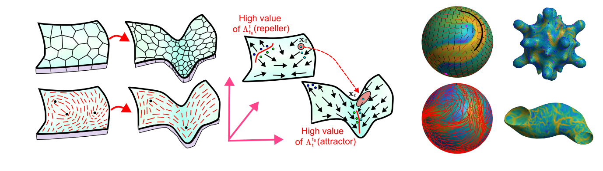

## Code to compute Eulerian coherent structures for flows on curved surfaces
This repository contains MATLAB codes to compute Eulerian coherent structures for flows on curved surfaces. Details regarding the method used to compute these quantities are given in the accompanying paper [S. Santhosh, C. Zhu, B. Fencil, M. Serra](). The tutorial on how to use this code is described in the [documentation](https://sreejithsanthosh.github.io/FTLEhub/docs/Tutorials/FTLECurvedSurface.html)  

